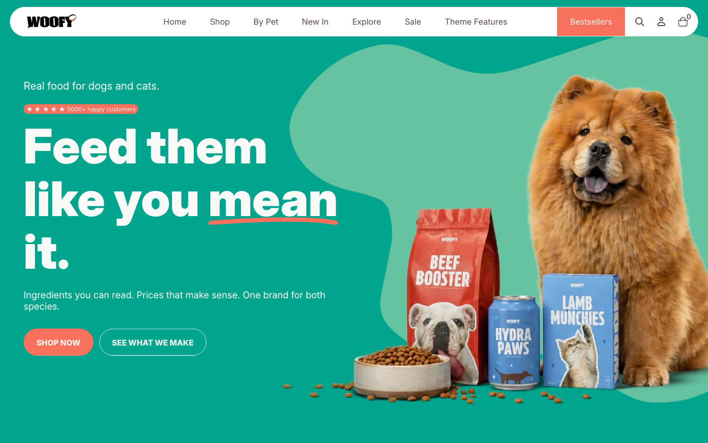

# Bold Slideshow

The Bold Slideshow is built for impact. It spans the full width of the page and supports slides with either an image or a video as the background, with text, buttons, and star ratings overlaid on top. It is the go-to choice for homepages or any page where you want to capture attention in the first few seconds.

📌 **When to use it:** Use it for the homepage hero or any page where a strong first impression is the priority.

*Bold Slideshow on the homepage.*

**On this page**

- [Section Settings](#section-settings)
  - [Content and Layout](#content-and-layout)
  - [Colors](#colors)
  - [Spacing](#spacing)
- [Blocks](#blocks)
  - [Image slide](#image-slide)
  - [Video slide](#video-slide)
  - [Shape Divider](#shape-divider)
- [Tips](#tips)
- [FAQ](#faq)

---

## ⚙️ Section Settings

### Content and Layout

| Setting | What it does |
|---|---|
| **Enable autoplay** | When enabled, slides advance automatically. |
| **Change slide every (seconds)** | How many seconds each slide is shown before advancing. |
| **Show navigation** | Shows the arrow and dot navigation controls for the slideshow. |
| **Section height (in percentage)** | Controls how tall the slideshow appears on desktop. Choose from preset options including full screen. |
| **Section height (mobile, in percentage)** | Controls how tall the slideshow appears on mobile. Can be set independently from desktop. |

### Colors

| Setting | What it does |
|---|---|
| **Section's color palette** | Applies a color palette to this section, controlling the background, text, and button colors. Color palettes are defined in Theme Settings. |
| **Use gradient as background** | When enabled, the section uses the gradient defined in the selected color palette instead of a solid background color. |

### Spacing

| Setting | What it does |
|---|---|
| **Padding top** | The amount of empty space above the section content on desktop, in pixels. Increase it to separate this section visually from the one above. |
| **Padding bottom** | The amount of empty space below the section content on desktop, in pixels. |
| **Padding top (mobile)** | The amount of empty space above the section on mobile, in pixels. Can be set independently from desktop. |
| **Padding bottom (mobile)** | The amount of empty space below the section on mobile, in pixels. |

---

## 🧩 Blocks

### Image slide

| Setting | What it does |
|---|---|
| **Image** | The background image for this slide on desktop. |
| **Mobile image** | A separate background image for mobile. If left blank, the desktop image is used. |
| **Heading** | The main heading displayed at the top of this block or section. |
| **Heading size** | Controls the visual size of the heading. Options are Small, Medium, Large, and Extralarge. |
| **Heading HTML tag** | The HTML tag used for the heading (H1, H2, H3, and so on). Use H1 only once per page, on the most important heading, as it signals the primary content to search engines. |
| **Highlighted text** | Enables an animated highlight effect on selected words inside the heading. To apply it to a word, select it in the editor and format it as italic. |
| **Highlighted text style** | The style of the highlight animation. Options include Underline, Scribble underline, Text color, Thick underline, Outline, and Background color. |
| **Highlighted text color** | The color applied to the highlighted words in the heading. |
| **Subheading** | A secondary line of text below the heading. Use it for a short supporting statement or tagline. |
| **Paragraph** | The body text for this block. Supports rich text formatting. |
| **Button text 1** | The label for the first button. Leave both button text fields blank to make the entire slide clickable instead. |
| **Button URL 1** | The URL the first button links to. |
| **Button style 1** | The visual style of the first button: Solid, Outlined, or Link. |
| **Button text 2** | The label for the second button. Leave blank to hide it. |
| **Button URL 2** | The URL the second button links to. |
| **Button style 2** | The visual style of the second button: Solid, Outlined, or Link. |
| **Content alignments** | Controls the horizontal alignment of the content block within the section: Left, Center, or Right. |
| **Content alignments (desktop)** | The position of the text block within the slide on desktop: Top left, Middle center, Bottom right, and so on. |
| **Content alignments (mobile)** | The position of the text block on mobile. Set independently from desktop. |
| **Content boxed** | Wraps the text content in a colored semi-transparent box, useful for readability on complex backgrounds. |
| **Box color** | The fill color of the content box. |
| **Box opacity** | How transparent the content box is. 0 is invisible, 100 is fully solid. |
| **Text color** | The color of text inside this section or block. |
| **Overlay protection** | A dark overlay applied on top of the image to improve text readability. 0 means no overlay, 100 means fully black. |
| **Overlay color** | A color tint applied on top of the background image to improve text readability. Black by default, but you can use any brand color. |
| **Show review stars** | Shows a star rating row above or below the heading to add social proof. |
| **Number of stars** | The number of stars to display. Options are 4, 4.5, and 5. |
| **Stars color** | The color of the star icons. |
| **Stars and following text background color** | An optional background color behind the stars and following text. |
| **Following text color** | The color of the text displayed next to the stars. |
| **Following text** | A short line of text displayed next to the stars, for example "Over 500 reviews" or "Rated 5 out of 5". |
| **Position** | Where the star rating row appears: Above heading, Below paragraph, or Below buttons. |

### Video slide

| Setting | What it does |
|---|---|
| **Choose video** | The background video file for this slide on desktop. Use MP4 format for best compatibility. |
| **Choose video (mobile)** | A separate background video for mobile. If left blank, the desktop video is used. |
| **Video alt text** | Alternative text describing the video for screen readers and accessibility. |
| **Heading** | The main heading displayed at the top of this block or section. |
| **Heading size** | Controls the visual size of the heading. Options are Small, Medium, Large, and Extralarge. |
| **Heading HTML tag** | The HTML tag used for the heading (H1, H2, H3, and so on). Use H1 only once per page, on the most important heading, as it signals the primary content to search engines. |
| **Highlighted text** | Enables an animated highlight effect on selected words inside the heading. To apply it to a word, select it in the editor and format it as italic. |
| **Highlighted text style** | The style of the highlight animation. Options include Underline, Scribble underline, Text color, Thick underline, Outline, and Background color. |
| **Highlighted text color** | The color applied to the highlighted words in the heading. |
| **Subheading** | A secondary line of text below the heading. Use it for a short supporting statement or tagline. |
| **Paragraph** | The body text for this block. Supports rich text formatting. |
| **Button text 1** | The label for the first button. Leave both button text fields blank to make the entire slide clickable instead. |
| **Button URL 1** | The URL the first button links to. |
| **Button style 1** | The visual style of the first button: Solid, Outlined, or Link. |
| **Button text 2** | The label for the second button. Leave blank to hide it. |
| **Button URL 2** | The URL the second button links to. |
| **Button style 2** | The visual style of the second button: Solid, Outlined, or Link. |
| **Content alignments** | Controls the horizontal alignment of the content block within the section: Left, Center, or Right. |
| **Content alignments (desktop)** | The position of the text block within the slide on desktop: Top left, Middle center, Bottom right, and so on. |
| **Content alignments (mobile)** | The position of the text block on mobile. Set independently from desktop. |
| **Content boxed** | Wraps the text content in a colored semi-transparent box, useful for readability on complex backgrounds. |
| **Box color** | The fill color of the content box. |
| **Box opacity** | How transparent the content box is. 0 is invisible, 100 is fully solid. |
| **Text color** | The color of text inside this section or block. |
| **Overlay protection** | A dark overlay applied on top of the image to improve text readability. 0 means no overlay, 100 means fully black. |
| **Overlay color** | A color tint applied on top of the background video to improve text readability. |
| **Show review stars** | Shows a star rating row above or below the heading to add social proof. |
| **Number of stars** | The number of stars to display. Options are 4, 4.5, and 5. |
| **Stars color** | The color of the star icons. |
| **Stars and following text background color** | An optional background color behind the stars and following text. |
| **Following text color** | The color of the text displayed next to the stars. |
| **Following text** | A short line of text displayed next to the stars, for example "Over 500 reviews" or "Rated 5 out of 5". |
| **Position** | Where the star rating row appears: Above heading, Below paragraph, or Below buttons. |

### Shape Divider

Adds a decorative SVG shape at the top or bottom of the section to create a smooth visual transition into the next section.

| Setting | What it does |
|---|---|
| **Choose position** | Whether the Shape Divider appears at the top or bottom of the section. |
| **Section's color palette** | The color palette of the divider shape. Typically matches the section it belongs to. |
| **Next section's background color** | The exact background color of the section immediately below this one. Setting this correctly makes the divider edge blend seamlessly. |
| **Style** | The visual shape of the divider: Waves, Deep waves, Arc, Big curve, Oblique line, Triangle, or one of the shaded pattern options. |

---

## 💡 Tips

- If your slides contain text worth reading, set autoplay to at least 6 or 7 seconds.

- Use a separate mobile image or video. Desktop media rarely crops well to portrait orientation.

- Increase Overlay protection if text is hard to read over a bright or complex image.

---

## ❓ FAQ

**Can I mix image slides and video slides in the same slideshow?**\
Yes. Add both block types to the same section. The order follows the block order in the Theme Editor.

**The video does not autoplay. Why?**\
Browsers block autoplay for videos that have an audio track. Make sure the video file is muted and in MP4 format.

**Are the star ratings connected to my store reviews?**\
No. Stars are set manually per slide. For real review data use the Reviews Showcase section instead.

